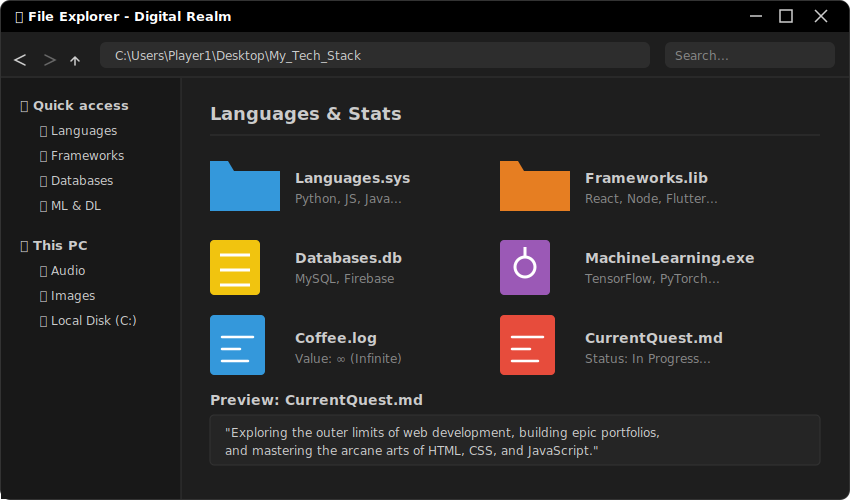

<!-- WINDOWS FILE EXPLORER THEME BANNER -->
<!-- The files inside this SVG are clickable and will jump to the sections below! -->

  

### 🚀 Welcome to my digital realm! 
I'm a developer who crafts interactive experiences, levels up daily, and conquers bugs in the matrix.

   

---

 

<h3 id="languages">💻 Languages</h3>

 

<h3 id="frameworks">🛠️ Frameworks, Platforms & Libraries</h3>

 

<h3 id="databases">🗄️ Databases</h3>

 

<h3 id="mldl">🧠 Machine Learning & Deep Learning</h3>

